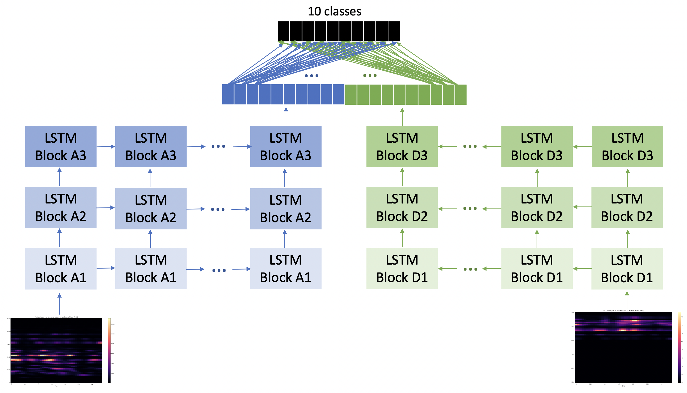

# WaveletMelSpectrogram
 This project is about exploring the combination of Discrete Wavelet Transform with the Mel Filter bank, to obtain a better feature for inputting into a Deep Learning model, which in this case is a LSTM

The model takes the inputs as the Approximate and the Detailed Coefficients obtained from one level of DWT. The model architecture is as follows - 
